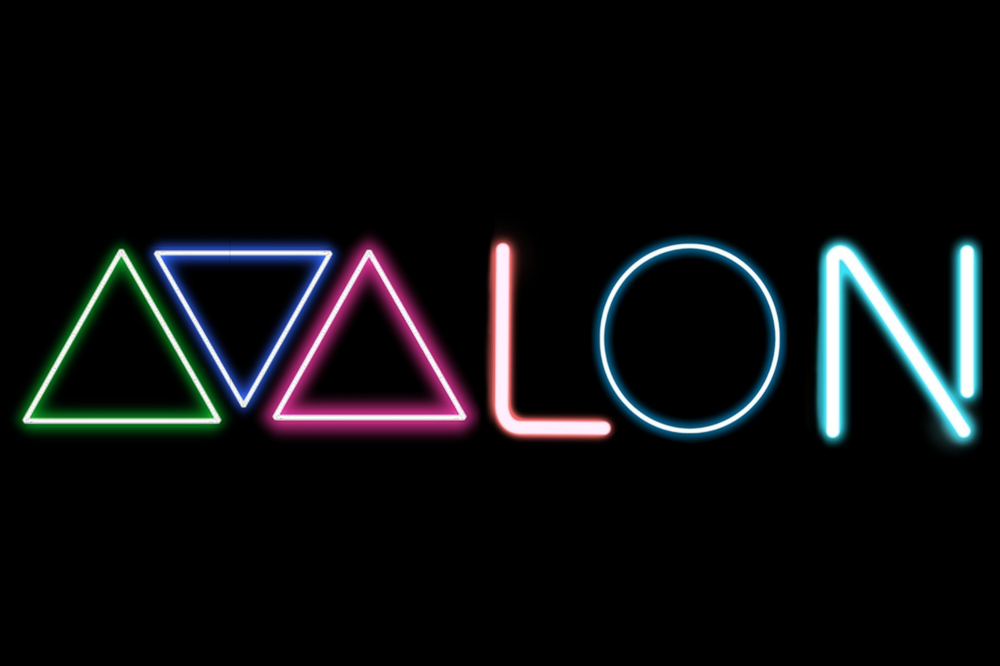

# AVALON
Avalon es un ecommerce de Buenos Aires, creada por Emiliano Rivarola, Agustina Zingariello,Ronaldo Vaca y Luciano Diosque, 4 amigos interesados en la creación de una pagina web que publique componentes de todo tipo y precio, juegos y demás productos funcionales para la comunidad gamer de argentina.
Como gamers aficionados que somos creemos que la comunidad merece ser tomada en serio y que los deportes electrónicos deben ser considerados como tales.

En el invierno del 2020 y en el medio de una pandemia los cuatro creadores se conocieron y pusieron en común su encanto por la computación y los videojuegos, pensaron entonces en que ninguna de las paginas vistas hasta ahora tomaba en serio a la comunidad, o les ofrecía una atención personalizada y se dispusieron a crear avalon, la isla de los gamers.

El nombre surge de la isla avalon, de la mitología celta, se trata de una isla donde viven 9 reinas hadas y el lugar de descanso final del rey arturo, es una isla donde crecen deliciosas manzanas todo el año.
Creemos que esta idea nos representa, una isla donde podes encontrar componentes y juegos todo el año, a un buen precio y con una buena orientación para encontrar exactamente lo que buscas.

## Integrantes :

- **_Agustina Zingariello_** : Llena de imaginación y creatividad con gran capacidad de proyección de ideas a causa de un gran manejo con el diseño gráfico. Posee una atracción hacía la programación ya que desea dedicarse a ello a largo plazo. Persona persistente y capaz de moldearse para superar cualquier tipo de problema.
- **_Damian Luciano_**: desde pequeño con gran entusiasmo por el mundo de la computación y los videojuegos, tiene poca experiencia programando, pero mucha voluntad para finalizar el proyecto. Posee también una capacitación artística que complementa muy bien a la página.
- **_Ronaldo vaca_**: La falta de experiencia la complemento con las ganas de aprender e investigar las nuevas tecnologías que nos rodean, creativo y trabajador
- **_Emiliano Rivarola_**: Con ganas de dedicarse a la programación, compañero, puntual, creativo, autodidacta, perfeccionista.

## Temática del Market Place:
Pagina dedicada al mundo Gamer.

## Objetivo:

Para todo aquel/aquella que desee entrar al mundo del gaming y quiera seguridad y confianza a la hora de comprar sus productos.

## Servicios:
Venta de hardware, armados de PC y asesoramiento a la hora de la compra.

## Referencias:

- **Estetica:**  

https://bestawards.co.nz/digital/ 

https://www.spinawards.nl/en/archive

- **Funcionalidad:**

https://www.maximus.com.ar/ 

https://www.templatemonsterpreview.com/es/demo/102406.html?_ga=2.76199389.937133897.1595426891-1319784960.1595426891  

https://www.spinawards.nl/en/archive 

- **Clientes y Productos:**

https://compragamer.com/  

https://www.fullh4rd.com.ar/  

https://www.logg.com.ar/ 

https://www.libreopcion.com/

https://www.gezatek.com.ar/

